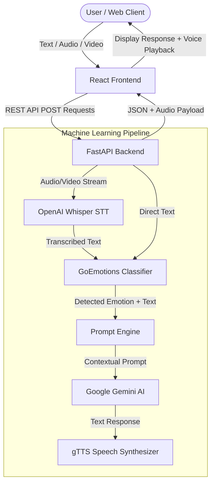

<div align="center">

  # HEALIO
  ### *Multimodal AI Mental Health Companion*

  [](https://reactjs.org/)
  [](https://fastapi.tiangolo.com/)
  [](https://pytorch.org/)
  [](https://huggingface.co/)
  [](https://github.com/openai/whisper)
  [](https://ai.google.dev/)

  <p align="center">
    A full-stack mental health support application featuring real-time emotion classification from text, voice, and video, combined with empathetic conversational AI.
  </p>

</div>

---

## Key Features

- **Multimodal Input Support**: Accepts text, uploaded audio files, live microphone voice recordings, and video uploads/webcam captures.
- **Advanced Emotion Classification**: Utilizes a fine-tuned GoEmotions Transformer model on PyTorch to detect 28 distinct emotional states with confidence scoring.
- **Speech-to-Text Transcription**: Powered by OpenAI's Whisper model for accurate speech transcription across audio and video inputs.
- **Empathetic AI Conversations**: Integrates Google Gemini AI to provide empathetic, contextual mental health support tailored to the user's detected emotional state.
- **Voice Response Generation**: Converts AI responses back into natural voice output using Text-to-Speech (gTTS).
- **Modern React UI**: Custom glassmorphism interface featuring dynamic emotion visualizers, real-time message streaming, and responsive design.

---

## System Architecture



---

## Technology Stack

| Layer | Technology | Purpose |
| :--- | :--- | :--- |
| **Frontend** | React 18, HTML5 Media APIs, CSS3 | Interactive chat UI, voice/video recording, media handling |
| **Backend API** | FastAPI, Uvicorn, Python 3.10+ | RESTful API endpoints, request routing, async task handling |
| **Speech-to-Text** | OpenAI Whisper (`base`) | Audio and video speech transcription |
| **Emotion Detection** | Hugging Face Transformers, PyTorch | GoEmotions classification across 28 emotional dimensions |
| **Generative AI** | Google Gemini API | Empathetic response generation and therapeutic follow-ups |
| **Text-to-Speech** | gTTS (Google Text-to-Speech) | Audio synthesis for bot responses |

---

## Repository Structure

```
Healio/
├── backend/                  # FastAPI Application
│   ├── main.py               # REST API endpoints & ML pipeline logic
│   └── requirements.txt      # Backend Python dependencies
├── frontend/                 # React Single Page Application
│   ├── public/               # Static assets & index.html
│   ├── src/                  # React components & CSS styling
│   │   ├── App.js            # Main React application & media handlers
│   │   ├── App.css           # Custom design system & animations
│   │   └── index.js          # React DOM entry point
│   └── package.json          # Frontend dependencies & scripts
├── src/                      # Backend Entry Module
│   └── main.py               # Uvicorn server launcher
├── .env.example              # Template for environment configuration
├── .gitignore                # Production ignore patterns
├── README.md                 # Project portfolio documentation
└── requirements.txt          # Root Python dependencies
```

---

## Getting Started

### Prerequisites
- **Python**: 3.9 or higher
- **Node.js**: 16.x or higher
- **Gemini API Key**: Obtain from [Google AI Studio](https://aistudio.google.com/)

### 1. Environment Setup

Clone the repository and set up environment variables:

```bash
git clone https://github.com/abh1ramkr/Healio.git
cd Healio

# Copy environment template
cp .env.example .env
```

Open `.env` and insert your Gemini API Key:
```env
GEMINI_API_KEY=your_actual_gemini_api_key_here
```

### 2. Backend Setup & Launch

```bash
# Create and activate virtual environment
python -m venv .venv

# On Windows:
.venv\Scripts\activate
# On macOS/Linux:
# source .venv/bin/activate

# Install dependencies
pip install -r requirements.txt

# Start FastAPI Server
python backend/main.py
```
*Backend API server runs at `http://127.0.0.1:8000`.*

### 3. Frontend Setup & Launch

In a new terminal window:

```bash
cd frontend
npm install
npm start
```
*React Web Application will open automatically at `http://localhost:3000`.*

---

## API Endpoints Summary

| Endpoint | Method | Description |
| :--- | :--- | :--- |
| `/login` | `POST` | User authentication (`admin` / `password`) |
| `/chat` | `POST` | Processes text input, returns emotion analysis & AI response |
| `/voice` | `POST` | Transcribes uploaded/recorded audio, detects emotions & responds |
| `/video` | `POST` | Transcribes uploaded/recorded video, detects emotions & responds |
| `/history` | `GET` | Retrieves active session conversation history |

---

## Portfolio & Contact

Developed as an AI Mental Health Companion project showcasing full-stack React and Python machine learning integration.

- **GitHub**: [@abh1ramkr](https://github.com/abh1ramkr)
- **Repository**: [Healio](https://github.com/abh1ramkr/Healio)